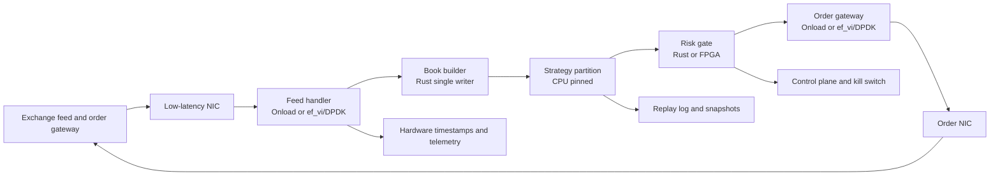

# Production Low-Latency Trading System Construction

## Objective

Construct a production-shaped low-latency trading system that can ingest market data, maintain state, make a decision, pass risk, and send an order with measurable and recoverable behavior.

The design below assumes a colocated or near-colocated deployment where the team controls the host, NIC, CPU topology, switch path, and software image. It is also a useful laboratory architecture: the same boundaries can be implemented first with ordinary Linux sockets and then upgraded selectively.

## Reference architecture



The business-critical path is deliberately narrow. Persistence, dashboards, research writes, configuration distribution, and incident tooling observe the path but do not block it.

## Physical and network design

### Colocation

Choose a facility and cross-connect based on the actual venue path, not a generic “close to exchange” label. Document:

- rack, cage, power feeds, and cross-connect IDs;
- exchange handoff and demarcation point;
- physical fiber length and optics;
- redundant paths and their failure behavior;
- switch ports, VLANs, QoS classes, and multicast configuration;
- clock source and PTP grandmaster path;
- remote-hands procedure and spare hardware.

The goal is a bounded path from wire to NIC and from NIC back to wire. A nearby rack with an extra switch, firewall, NAT, or overloaded shared fabric may be worse than a slightly farther but simpler cross-connect.

### Host topology

Select a server where the NIC, FPGA, and CPU cores share a favorable PCIe and NUMA topology. Record the mapping:

```text
NIC port 0 -> PCIe root 0 -> NUMA node 0 -> cores 2-5
NIC port 1 -> PCIe root 1 -> NUMA node 1 -> cores 18-21
FPGA       -> PCIe root 0 -> NUMA node 0
```

Keep feed handler memory and execution cores local to the NIC that owns the queue. Cross-socket memory access may be acceptable for background work but should be measured before entering the hot path.

## Choose the packet path by stage

### Start with ordinary sockets

Build a correct protocol implementation, replay harness, timestamps, and counters first. This provides a reference path and a fallback mode.

### Add Onload for socket-compatible traffic

Use Onload for supported TCP/UDP connections where the application benefits from a lower-jitter path without rewriting all protocol code. Validate acceleration and fallback behavior. It is especially useful for order-entry sessions that must remain socket-oriented.

### Add ef_vi or DPDK for packet-specialist paths

Use ef_vi or DPDK when raw queue ownership, multicast receive, packet filtering, or custom protocol handling is the bottleneck. Keep the output as normalized application events so the book and strategy code do not depend on a NIC API.

### Add FPGA only for a proven stable function

Start with timestamping, feed decode, filtering, or a simple risk check. Require a software oracle, hardware-in-the-loop tests, shadow mode, and a rollback bitstream.

## Host configuration baseline

Treat the host image as a versioned artifact. Record and test:

- BIOS power and C-state policy;
- CPU frequency and turbo behavior;
- SMT policy;
- core isolation and affinity;
- NUMA and PCIe mapping;
- hugepages and locked-memory limits;
- IOMMU/VFIO configuration;
- NIC firmware and driver;
- Onload/ef_vi or DPDK release;
- FPGA bitstream and register configuration;
- PTP daemon and clock source;
- kernel version and relevant sysctls.

Do not copy a tuning checklist blindly. Every setting needs a before/after measurement and a rollback procedure.

## Software boundaries

```text
wire adapter
  -> packet adapter
  -> protocol decoder
  -> normalized event
  -> sequencer / gap detector
  -> book state
  -> strategy decision
  -> risk decision
  -> order command
  -> protocol encoder
  -> wire adapter
```

Each boundary should define:

- ownership of memory;
- ordering key;
- timestamp semantics;
- capacity and overflow policy;
- error and recovery behavior;
- test fixture and replay representation.

## LMAX-style event core

For the deterministic state core, apply the LMAX lesson before reaching for more hardware: keep one writer for each matching or strategy partition, feed it a bounded preallocated event ring, and publish immutable results to journal, market-data, risk, and telemetry consumers.

```text
gateway -> command ring -> single-writer state core
                              |
                              +-> journal / replica
                              +-> market-data consumer
                              +-> risk and control consumer
```

The Disruptor pattern is useful here because it makes capacity, sequence, consumer dependencies, and wait behavior explicit. It is not a replacement for DPDK, Onload, FPGA, or RDMA. Those technologies move data to and from the process; an LMAX-style core controls how ordered state changes inside it.

## Data structures and hot-path rules

- Use integer price ticks and bounded quantities.
- Preallocate live orders, packet buffers, and event storage.
- Use a single writer per book or strategy partition where possible.
- Use bounded queues with visible depth and overflow counters.
- Avoid blocking I/O, heap allocation, string formatting, and synchronous logging in the critical path.
- Publish immutable events to downstream consumers.
- Separate monotonic latency clocks from exchange event time and wall time.

These rules are not an excuse to make the whole system lock-free. They are a way to make the critical path explicit and measurable.

## FPGA integration contract

An FPGA function should expose a narrow versioned contract:

```text
input:  frame bytes + ingress timestamp + configuration version
output: normalized event + egress timestamp + sequence status
errors: malformed, gap, overflow, reset, config mismatch
```

The CPU and FPGA paths must be able to consume the same capture and produce comparable output. During shadow mode, the FPGA output is observed but does not drive orders. Promote it only after message-by-message equivalence and incident drills.

## Measurement and acceptance gates

Instrument at hardware boundaries:

```text
t0 wire ingress
t1 NIC receive
t2 parser complete
t3 book update
t4 strategy decision
t5 risk pass
t6 order handed to NIC
t7 wire egress
```

Report:

- p50, p99, p99.9, and maximum latency;
- packet loss, sequence gaps, and retransmissions;
- queue depth and buffer occupancy;
- CPU cycles and cache misses;
- NUMA and PCIe locality;
- order rejects and risk-fail counts;
- replay divergence count;
- clock offset and timestamp quality.

Acceptance should use captured or generated traffic with realistic bursts, message sizes, symbol counts, cancels, duplicates, gaps, and exchange rejects. A synthetic one-packet-at-a-time benchmark is only a component test.

## Failure handling

### Feed gap

Stop trusting the affected book, request or perform venue recovery, replay the gap, and only resume strategy decisions after a sequence and state checkpoint passes validation.

### NIC or accelerator failure

Fail over to a warm standby or a slower kernel path. Preserve the last known sequence, orders, and risk state. Never silently continue from an unverified book.

### Risk or control-plane failure

Fail closed for new orders while preserving cancel capability if possible. The kill switch must be independent of the strategy process and tested under process, NIC, and network failures.

### Clock failure

Keep monotonic local measurements available, mark wall-clock timestamps degraded, and disable workflows that require regulatory or cross-host time guarantees until synchronization recovers.

## Rollout sequence

1. Build the ordinary-socket reference implementation.
2. Add replay, deterministic state checks, and hardware timestamp capture.
3. Deploy in a lab with production NICs, switch configuration, and packet captures.
4. Run Onload or DPDK in receive-only mode.
5. Run the strategy and risk path in shadow mode.
6. Add FPGA functions as non-authoritative shadows.
7. Compare outputs and latency distributions for sustained bursts.
8. Enable limited production traffic with strict limits.
9. Expand only after incident drills and rollback tests pass.

The production artifact is more than a binary. It includes host image, NIC firmware, FPGA bitstream, switch configuration, venue session configuration, symbol metadata, clock configuration, replay fixtures, dashboards, and rollback instructions.

## Cost and complexity boundary

Use the simplest path that meets the measured requirement. A colocated FPGA/DPDK/Onload stack may be justified for a venue where microseconds change queue position. It may be the wrong choice for a public-cloud crypto strategy dominated by exchange processing and internet variability. The architecture should earn each layer through measurement.

## References

- [AMD/Xilinx: Onload User Guide](https://www.xilinx.com/content/dam/xilinx/publications/solarflare/onload/enterprise-onload/SF-104474-CD-34_Onload_User_Guide.pdf)
- [AMD: ef_vi User Guide](https://docs.amd.com/r/en-US/ug1586-onload-user/ef_vi?contentId=BOFxy7Gif8zBb26BhDBz_g)
- [DPDK overview](https://doc.dpdk.org/guides-26.07/prog_guide/overview.html)
- [DPDK EAL](https://doc.dpdk.org/guides/prog_guide/env_abstraction_layer.html)
- [DPDK VFIO and Linux drivers](https://doc.dpdk.org/guides-25.07/linux_gsg/linux_drivers.html)
- [NVIDIA: GPUDirect RDMA](https://docs.nvidia.com/cuda/gpudirect-rdma/)
- [Linux: PTP hardware clock infrastructure](https://www.kernel.org/doc/html/latest/driver-api/ptp.html)
- [Linux: hardware packet timestamps](https://www.kernel.org/doc/html/latest/networking/packet_mmap.html)
- [High Frequency Trading Acceleration Using FPGAs](https://doi.org/10.1109/FPL.2011.64)
- [LMAX Disruptor technical paper](https://lmax-exchange.github.io/disruptor/disruptor.html)
- [The LMAX Architecture](https://martinfowler.com/articles/lmax.html)

Related:

- [[37 - Kernel Bypass Technologies Deep Dive]]
- [[39 - Matching Engine Deployment, FPGA, DPDK, and Cloud Colocation]]
- [[68 - InfiniBand and RDMA Deep Dive]]
- [[69 - DPDK Deep Dive]]
- [[70 - Solarflare Onload and ef_vi Deep Dive]]
- [[71 - FPGA Market Data Pipeline Deep Dive]]
