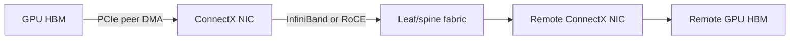

# HFT to AI Infrastructure Technology Transfer

## Thesis

Modern AI infrastructure and electronic trading share a systems problem: move small or large messages through a distributed machine with predictable latency, high throughput, low CPU overhead, and enough observability to explain tail events. The overlap is real, but the historical story needs precision.

The strongest claim is not that HFT invented the infrastructure used by AI. RDMA, InfiniBand, vectorized analytics, precision time, and FPGAs also have deep roots in HPC, telecommunications, databases, and scientific instrumentation. A more defensible thesis is:

> HFT was an unusually demanding customer and proving ground for deterministic networking, packet processing, timestamping, FPGA pipelines, and latency-aware software. Vendors, engineers, and design patterns then became useful in AI and hyperscale systems, where the traffic volume and parallelism are much larger but the optimization target is usually throughput and utilization rather than the absolute minimum single-message latency.

This distinction matters. It separates documented product lineage from an attractive but usually unproven story about direct technology transfer between firms.

## Confidence map

| Claim | Assessment | Why |
| --- | --- | --- |
| ConnectX and InfiniBand are central to modern GPU clusters | Strong | The InfiniBand Trade Association documents RDMA, low CPU overhead, and AI/HPC deployment; NVIDIA documents GPUDirect RDMA and the Mellanox acquisition. |
| HFT was the original source of RDMA/InfiniBand | Weak | RDMA and InfiniBand have documented HPC and datacenter lineages. HFT was an important adopter, not the sole origin. |
| Solarflare Onload is kernel bypass useful for trading and HPC | Strong | AMD/Xilinx documentation explicitly describes user-level TCP/UDP, direct NIC access, kernel-bypass behavior, and trading/HPC workloads. |
| HFT refined RDMA into the transport for AI | Weak to medium | RDMA is a major AI transport, but its standards and HPC lineage predate current AI clusters. HFT contributed operational pressure and specialist adoption. |
| HFT FPGA techniques transferred into AI inference | Medium | Both domains use streaming pipelines, fixed-function parsing, and predictable dataflow. Direct personnel or IP transfer is case-specific and should not be generalized. |
| kdb+/q and ClickHouse are the same lineage | Weak | Both benefit from columnar/vectorized analytics, but ClickHouse originated at Yandex and has a separate engineering history. |
| HFT timestamping hardened infrastructure used by distributed AI | Medium | PTP and hardware timestamping are shared mechanisms. Their use in AI is usually for synchronization, telemetry, and debugging rather than market-order sequencing. |
| HFT coding patterns became standard in CUDA and inference | Medium | The practices overlap, but they also come from HPC, operating systems, databases, and real-time systems. “Shared performance culture” is safer than a one-way causal claim. |

## 1. InfiniBand, ConnectX, and the GPU fabric

InfiniBand is a switched, point-to-point fabric with reliable messaging and RDMA memory semantics. RDMA allows a network adapter to place data into a remote memory region without making the remote CPU copy every byte through the kernel networking path. This reduces CPU work and makes communication latency and jitter more predictable.

The important AI connection is the placement of the NIC beside the accelerator. NVIDIA GPUDirect RDMA allows a third-party PCIe peer, such as a network adapter, to exchange data directly with GPU memory. NVIDIA's documentation describes the mechanism as a direct path between a GPU and a peer device, subject to PCIe topology and memory-registration constraints. NVIDIA PeerDirect extends this idea to RDMA applications over InfiniBand or RoCE, reducing copies between peer devices.

ConnectX adapters therefore sit at an important boundary:



The trading connection is credible at the level of adoption and requirements. Colocated trading systems value low and predictable packet latency, hardware timestamping, and direct access to receive/transmit queues. Those requirements made low-latency NICs, RDMA verbs, and specialized network fabrics commercially valuable. But the historical origin should be stated carefully: InfiniBand and RDMA were also built for HPC, clustering, and storage. The AI cluster is a convergence of those lineages, not simply a repurposed trading network.

NVIDIA completed its acquisition of Mellanox in 2020. The strategic result was unusually coherent: GPU compute, GPU-aware networking, collective communication, and the NIC/fabric could be designed as one platform.

## 2. Kernel bypass: OpenOnload, ef_vi, DPDK, and user-space data planes

Solarflare's Onload is an accelerated user-level TCP/UDP stack. The application is linked to a library that provides direct, safe access to the adapter and avoids normal system-call, context-switch, and interrupt costs on the hot path. The Solarflare guide explicitly names market-data and trading applications as well as HPC and message-passing workloads.

This is more precise than saying “DMA packets straight into user space.” The NIC still performs DMA, but the complete design includes:

- pinned or otherwise DMA-compatible buffers;
- receive and transmit queues owned by a user-space library;
- flow steering so the right application receives the packet;
- polling or carefully controlled event handling;
- a user-space protocol or packet-processing path;
- explicit memory ownership and reclamation.

DPDK generalizes the same broad idea for packet processing: poll-mode drivers, preallocated mbuf pools, hugepage-backed memory, queue/core affinity, and user-space control of NIC queues. OpenOnload preserves a sockets programming model; DPDK usually exposes a lower-level packet-processing model. They should not be treated as interchangeable products.

The AI connection is strongest in infrastructure components that need high packet rates and low CPU overhead: distributed training, inference gateways, service meshes, storage paths, load balancers, and SmartNIC/DPU software. The optimization target changes, however. A trading feed handler may optimize the median and tail of a single packet-to-decision path. Training fabrics optimize aggregate bandwidth, collective progress, congestion behavior, and GPU utilization across thousands of flows.

## 3. RDMA, RoCE, GPUDirect, and collective communication

RDMA is a data-movement primitive, not a complete AI communication algorithm. RoCE carries RDMA semantics over Ethernet. RoCE deployments often require careful quality-of-service and congestion configuration; a “lossless Ethernet” design is not automatic simply because the network uses RDMA.

The AI stack usually has several layers:

1. The model runtime produces a collective operation such as all-reduce.
2. NCCL, RCCL, MPI, or another collective library selects an algorithm and topology.
3. The library uses GPU-aware transport paths such as NVLink, PCIe, InfiniBand, or RoCE.
4. GPUDirect RDMA and peer-memory support reduce copies and CPU involvement.
5. Switch and NIC features control congestion, ordering, and queue behavior.

This layered view avoids the inaccurate statement that “RDMA exchanges gradients and activations” by itself. RDMA is the low-level transport and memory-access mechanism; the collective library defines how gradients or activations are partitioned and synchronized.

The shared lesson from HFT is operational: a fast transport is useful only when queueing, congestion, NUMA placement, memory registration, PCIe topology, and tail latency are measured together. In AI, an occasional long stall can delay an entire collective, so a networking problem becomes a synchronization problem at job scale.

## 4. FPGA feed handlers and AI inference accelerators

Electronic trading is a natural FPGA workload because market-data messages are structured streams. A pipeline can parse fields, validate sequence numbers, update an order book, calculate derived values, and emit a decision without repeatedly traversing a general-purpose operating-system stack. Published FPGA work on FIX/FAST decoding reports sub-microsecond-class latency in a specialized accelerator, illustrating the kind of deterministic pipeline that makes FPGAs attractive.

The reusable design ideas are:

- streaming rather than batch processing;
- fixed-width records and explicit state machines;
- deep pipelines with one stage per transformation;
- bounded buffers and backpressure;
- parallel handling of independent fields or instruments;
- fixed-point arithmetic where numerical requirements permit it;
- verification against a software reference model;
- latency budgets attached to each pipeline stage.

These ideas transfer well to some AI inference workloads, especially small-batch or streaming inference, preprocessing, compression, feature extraction, and networking-adjacent operators. They transfer less directly to large dense neural-network training, where GPUs and ASICs benefit from enormous matrix throughput, high-bandwidth memory, and mature compiler ecosystems.

The right conclusion is not “HFT FPGAs became AI GPUs.” It is that HFT helped develop a population of engineers and methods for building verified, pipelined, low-jitter dataflow hardware. That capability is adjacent to, and sometimes embedded within, AI accelerator design.

## 5. Vectorized and columnar analytics: kdb+/q and ClickHouse

kdb+/q is a financial time-series system designed around in-memory/vectorized computation, temporal data, and the combination of streaming and historical analysis. That makes it particularly well suited to tick data, order-book histories, backtesting, and post-trade analytics.

ClickHouse shares important architectural ideas: columnar storage, vectorized execution, compression, selective reads, and parallel scans. These properties make it useful for event logs, observability, feature preparation, and large analytical datasets. ClickHouse's own history places the server's introduction at Yandex in 2012, so it should not be described as a direct descendant of kdb+/q. The more defensible relationship is convergent design under similar analytical pressure.

For AI data systems, the transferable pattern is:

```text
raw events -> normalized immutable records -> columnar storage
           -> vectorized filters/aggregations -> features and evaluation sets
```

HFT contributes a particularly strong data-discipline angle: event time versus receive time, sequence gaps, correction messages, venue-specific semantics, and replayability. These concerns are just as important for training data and production inference telemetry. A fast database cannot repair an incorrect event clock or silently mixed schema.

## 6. Hardware timestamping and PTP

Precision Time Protocol, standardized as IEEE 1588, synchronizes clocks across a network. Accuracy depends on where timestamps are taken and on path-delay symmetry. Hardware timestamping at the NIC or PHY can avoid much of the uncertainty introduced by software scheduling.

In trading, timestamps help establish packet ordering, measure feed-to-decision and decision-to-wire latency, compare venues, and satisfy audit or regulatory requirements. Linux exposes PTP hardware clocks and socket timestamping through a standard interface; ConnectX devices are among the supported hardware families.

In AI and distributed systems, PTP is useful for:

- correlating NIC, host, GPU, switch, and storage events;
- diagnosing collective stalls and queue buildup;
- aligning distributed traces;
- measuring service-level latency across machines;
- providing a stable wall-clock reference for operational events.

The difference is semantic. HFT often cares about ordering and causality at the packet/event boundary. AI training usually cares about synchronized measurement and debugging, while the collective protocol itself handles the correctness of gradient exchange. PTP improves the evidence available to operators; it is not a replacement for barriers, sequence numbers, or collective synchronization.

## 7. Lock-free, zero-allocation, cache-aware software

The common performance vocabulary includes bounded queues, preallocated objects, cache-line-aware layouts, CPU affinity, huge pages, NUMA locality, busy polling, and avoiding syscalls or allocations in a critical path. LMAX's Disruptor is a clear public example from an exchange technology organization: it was motivated by queue latency, cache misses, lock costs, preallocation, and a hardware-aware design.

These techniques are not uniquely financial. They also come from operating systems, networking, real-time computing, HPC, databases, and language-runtime engineering. The HFT contribution is the intensity of the end-to-end feedback loop: a few microseconds can change queue position, fill probability, or economic value, so the team measures the entire path rather than optimizing an isolated function.

The transfer to CUDA and inference servers is therefore a set of habits and constraints:

- minimize data movement before minimizing arithmetic;
- keep hot state compact and local;
- separate control-plane work from the data plane;
- make ownership and backpressure explicit;
- preallocate when latency variance matters;
- pin work to the topology that owns the data;
- benchmark distributions and tail latency, not only averages;
- preserve a correctness oracle for every fast path.

The caveat is important: lock-free is not automatically faster, and huge pages or CPU pinning can hurt when applied without topology and workload evidence. These are hypotheses to benchmark, not universal rules.

## 8. Additional technologies in the same convergence

### GPUDirect Storage

GPUDirect Storage applies the direct-data-movement idea to storage: a supported storage device can move data toward GPU memory while reducing unnecessary CPU copies. This is conceptually related to GPUDirect RDMA, but it solves a storage path rather than a network path.

### SmartNICs and DPUs

SmartNICs and DPUs move selected infrastructure work away from the host CPU: packet filtering, virtualization, security, storage, telemetry, or collective-communication support. Their design space resembles the HFT desire to keep the critical data path close to the wire, but they must also provide isolation, programmability, and multi-tenant safety.

### In-network and topology-aware collectives

AI systems increasingly exploit the topology of GPUs, PCIe roots, NICs, switches, and racks. Hierarchical all-reduce, switch-assisted reduction, and topology-aware routing are the AI-specific continuation of a general low-latency systems principle: place computation and communication where the data already is.

### Hardware telemetry and observability

Per-packet timestamps, NIC counters, switch telemetry, GPU activity traces, and distributed tracing form a shared measurement discipline. The more asynchronous and parallel the system, the less useful a single application log timestamp becomes.

## Practical implications for an HFT engineer moving into AI systems

1. Learn the topology first: GPU, PCIe root complex, NUMA node, NIC, switch, and storage placement.
2. Treat RDMA as a mechanism below a collective library, not as the collective algorithm itself.
3. Measure p50, p99, p99.9, bandwidth, retransmission/congestion behavior, and GPU idle time together.
4. Keep event-time, receive-time, device-time, and wall-clock semantics separate.
5. Use FPGA experience for streaming pipelines, verification, fixed-latency preprocessing, and protocol offload; do not assume it replaces GPU matrix throughput.
6. Bring HFT data lineage discipline to training data: immutable raw events, schema versions, gap detection, replay, and reproducible transformations.
7. Reuse low-latency software patterns only after checking whether the AI workload is latency-bound, throughput-bound, memory-bound, or synchronization-bound.

## References

1. [InfiniBand Trade Association: About InfiniBand](https://www.infinibandta.org/about-infiniband/)
2. [NVIDIA: GPUDirect RDMA documentation](https://docs.nvidia.com/cuda/gpudirect-rdma/)
3. [NVIDIA: PeerDirect documentation](https://docs.nvidia.com/doca/sdk/NVIDIA-PeerDirect/index.html)
4. [NVIDIA: Completion of the Mellanox acquisition](https://nvidianews.nvidia.com/news/nvidia-completes-acquisition-of-mellanox-creating-major-force-driving-next-gen-data-centers)
5. [AMD/Xilinx: Solarflare Onload User Guide](https://www.xilinx.com/content/dam/xilinx/publications/solarflare/onload/enterprise-onload/SF-104474-CD-34_Onload_User_Guide.pdf)
6. [AMD: Solarflare Onload](https://www.amd.com/en/products/ethernet-adapters/onload.html)
7. [NVIDIA: RoCE documentation](https://docs.nvidia.com/networking-ethernet-software/cumulus-linux/Layer-1-and-Switch-Ports/Quality-of-Service/RDMA-over-Converged-Ethernet-RoCE/)
8. [NVIDIA: NCCL Developer Guide](https://docs.nvidia.com/deeplearning/nccl/archives/nccl_234/pdf/NCCL-Developer-Guide.pdf)
9. [Meta Engineering: RDMA over Ethernet for Distributed AI Training at Meta Scale](https://engineering.fb.com/wp-content/uploads/2024/08/sigcomm24-final246.pdf)
10. [Dou, Zhou, and Xin: An Accelerator for Decoding Market Data Based on FPGA](https://doi.org/10.1142/S0218126619500506)
11. [High Frequency Trading Acceleration Using FPGAs](https://doi.org/10.1109/FPL.2011.64)
12. [KX: kdb+](https://kx.com/products/kdb/)
13. [ClickHouse: Ten years of ClickHouse in open source](https://clickhouse.com/blog/open-source-10)
14. [ClickHouse: What is a columnar database?](https://clickhouse.com/resources/engineering/what-is-columnar-database)
15. [IEEE 1588 Working Group: IEEE 1588-2019](https://sagroups.ieee.org/1588/news/ieee-1588-2019-evolves-to-better-serve-its-wide-variety-of-applications/)
16. [Linux kernel: PTP hardware clock infrastructure](https://www.kernel.org/doc/html/latest/driver-api/ptp.html)
17. [Linux kernel: Packet MMAP and hardware packet timestamps](https://www.kernel.org/doc/html/latest/networking/packet_mmap.html)
18. [LMAX: Disruptor](https://lmax-exchange.github.io/disruptor/)
19. [LMAX: Disruptor User Guide](https://lmax-exchange.github.io/disruptor/user-guide/)

## Related notes

- [[37 - Kernel Bypass Technologies Deep Dive]]
- [[39 - Matching Engine Deployment, FPGA, DPDK, and Cloud Colocation]]
- [[18 - Time and Timestamp Semantics]]
- [[14 - Low-Latency Systems Foundations]]
- [[25 - Logging and Telemetry Deep Dive]]
- [[40 - Data Systems Hub]]
